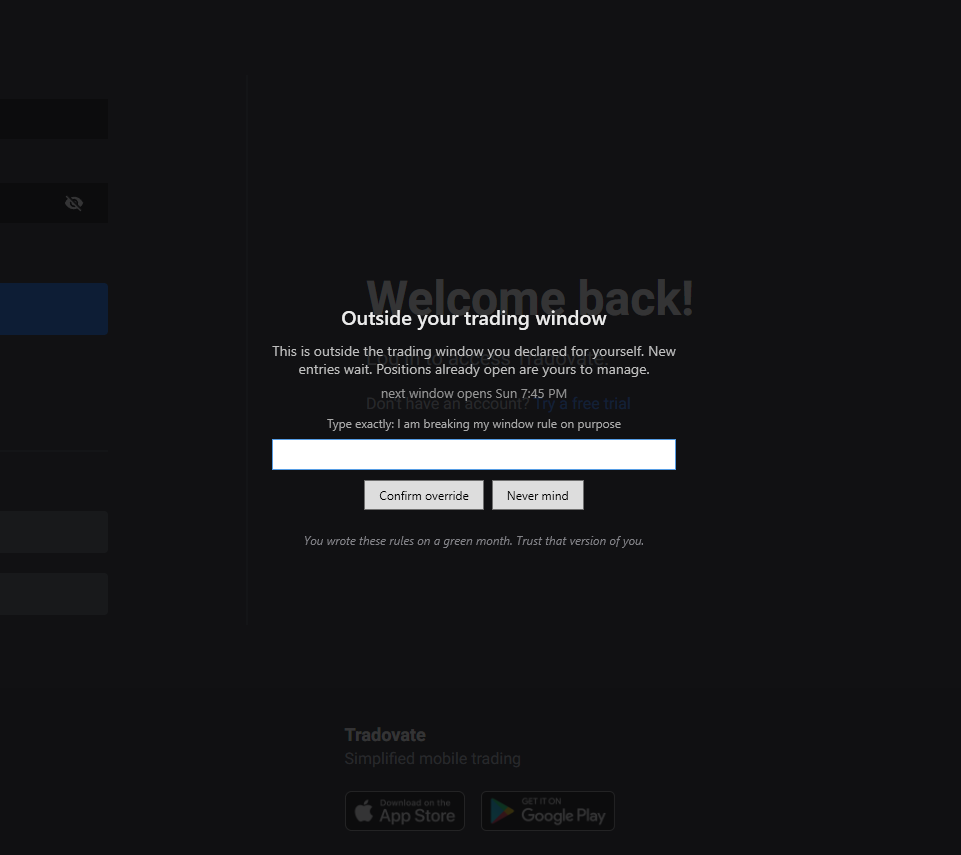
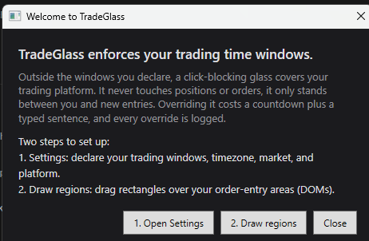
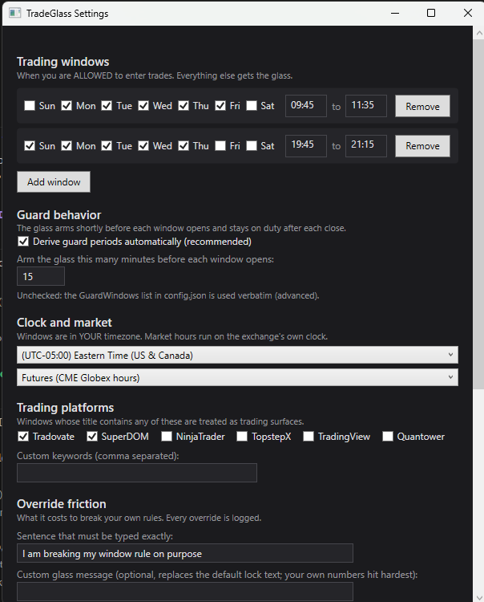

# TradeGlass

A discipline overlay for traders. You declare the time windows in which you
allow yourself to enter trades. Outside those windows, while your market is
open and your trading platform is on screen, a semi-transparent
click-blocking glass covers your order-entry areas. You can still see
prices. You cannot click through.

TradeGlass never touches your positions, orders, or broker account. It is
not connected to anything. It blocks pixels, which is exactly why it works
on platforms and prop accounts where automation and API access are banned.

Overriding the glass is possible, on purpose: it costs a 30 second
impulse-check countdown plus typing a full sentence, and every override is
written to a local log with a timestamp. This is friction, not a cage. The
bet is that impulses decay faster than a countdown, not that you are
imprisoned.

## What it looks like

The glass over a trading platform, override in progress:



First launch:



Every knob, no JSON required:



## What it does

- Enforces recurring trading windows you declare (e.g. 9:45 to 11:35 AM,
  weekdays), in your own timezone
- Arms shortly before each window opens, covering the pre-open rush zone,
  and stays on duty after each close
- Detects trading platforms by window title (Tradovate, NinjaTrader,
  TopstepX, and others, fully configurable), desktop apps and browser tabs
  alike
- Disappears completely when your platform is closed or your market is shut.
  Weekends: invisible, zero footprint
- Chimes when your window opens, warns you minutes before it closes
- Logs every override, pause, and settings change to a local JSONL file

## What it deliberately does not do

- Touch positions or working orders. A trade opened inside your window is
  yours to manage after the window closes; the glass only blocks NEW entries
- Connect to your broker, send data anywhere, or require an account.
  Everything is local
- Enforce P&L rules. Loss limits are your broker's job and most platforms
  offer them natively. TradeGlass does time, and only time
- Physically prevent a determined you. Task Manager kills it in seconds.
  Every escape leaves a gap in the log, and the log does not lie

## Install

### Option A: prebuilt zip (recommended)

1. Download the latest zip from this repo's Releases page, or use the one
   that was sent to you directly.
2. Install the .NET 8 Desktop Runtime if you do not have it:
   https://dotnet.microsoft.com/download/dotnet/8.0 (the "Desktop Runtime"
   installer, not the SDK). Without it the exe will not start.
3. Unzip TradeGlass.exe anywhere permanent, e.g. `C:\Tools\TradeGlass\`.
4. First launch of a downloaded exe: Windows SmartScreen may show
   "Windows protected your PC". Click "More info", then "Run anyway".
   This is the standard fate of unsigned software; see the antivirus
   section below for why. If you would rather not take that on faith,
   Option B exists precisely so you can read and build it yourself.

### Option B: build from source

1. Install the .NET 8 SDK: https://dotnet.microsoft.com/download/dotnet/8.0
2. Clone or download this repo, then from the project folder:

```powershell
dotnet publish -c Release -r win-x64 --self-contained false /p:PublishSingleFile=true
```

3. The exe lands in `bin\Release\net8.0-windows\win-x64\publish\TradeGlass.exe`.

### Antivirus honesty

Your antivirus will probably flag the exe. This is the standard fate of any
freshly compiled, unsigned executable that draws always-on-top windows: the
behavior pattern-matches screen-hijacking malware, and heuristics cannot
tell a discipline tool from a threat. You have the full source in front of
you and compiled it yourself, which is the strongest trust position software
can offer. Add a folder exception for the project directory in your
antivirus and move on. If that sentence makes you uncomfortable, read the
source first. It is small on purpose.

### Run at startup (recommended)

A discipline tool you must remember to launch is broken by design. Press
Win+R, type `shell:startup`, Enter, and put a shortcut to the published exe
in that folder. It now starts with Windows, lives in the system tray, and
decides on its own when the glass is needed.

## First run

On first launch a welcome window walks you through the two setup steps:

1. **Settings** (tray icon, right click): declare your trading windows,
   timezone, market calendar, and platform keywords
2. **Draw regions**: the screen dims; drag a rectangle over each order-entry
   area (your DOMs). Charts and everything else stay uncovered and clickable.
   Backspace removes the last rectangle, Enter saves

That is the whole setup. From then on it runs itself.

## Configuration

Everything lives in the Settings window. For the curious or the advanced,
the same values live in `%APPDATA%\TradeGlass\config.json`:

- Trading windows, days plus start and end times, in your timezone
- Guard behavior: auto-derived by default (arms N minutes before each open);
  set `AutoDeriveGuards` false to hand-author `GuardWindows` in JSON
- Market calendar: `futures` (CME Globex), `us_equities` (9:30 to 4 ET), or
  `always_open` (crypto). Exchange hours run on the exchange's clock,
  your windows run on yours
- Override sentence, impulse-check seconds, unlock minutes
- `CustomGlassMessage`: replace the default lock text with your own words.
  Your own numbers hit hardest
- `FooterQuotes`: one line shown on the glass, rotating daily

If the config file is ever corrupted, it is backed up (not overwritten) and
the app tells you.

The violation log is `%APPDATA%\TradeGlass\violations.jsonl`, one JSON
object per line: overrides, pauses, exits, settings changes. Review it
honestly. It is the whole point.

## Honest limitations

- Friction, not force. Killing the process defeats it. The log remembers
- Mouse clicks only. If you enter orders via keyboard hotkeys, keystrokes
  can reach a focused platform window behind the glass
- Regions are static rectangles. If you rearrange your platform windows,
  re-drag the regions (30 seconds via the tray menu)
- Window-title detection cannot tell your platform from a browser tab with
  a similar title; tune the keywords in Settings if false positives annoy you
- Exchange holidays are not modeled; on a holiday the glass may patrol a
  shut market, which is harmless
- Mixed-DPI multi-monitor: saved region pixels are correct, but preview
  rectangles while dragging may render slightly offset. Trust the save
- Windows only

## Privacy

No network calls. No telemetry. No account. Your config and your violation
log are files on your machine, and they never leave it.

## License

See LICENSE.